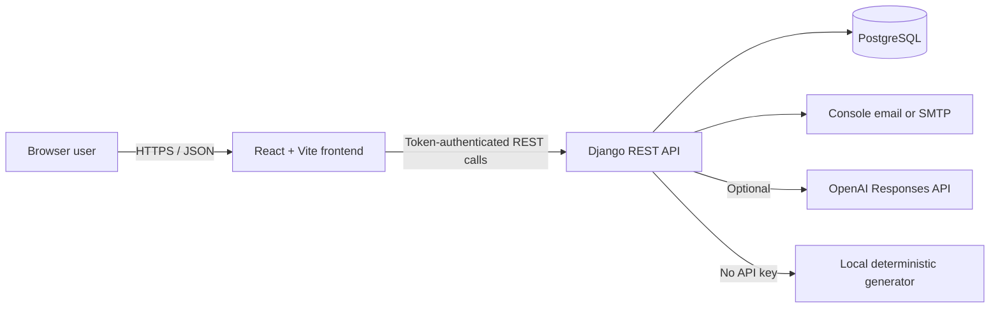
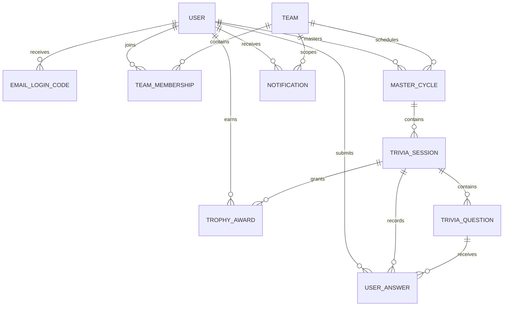
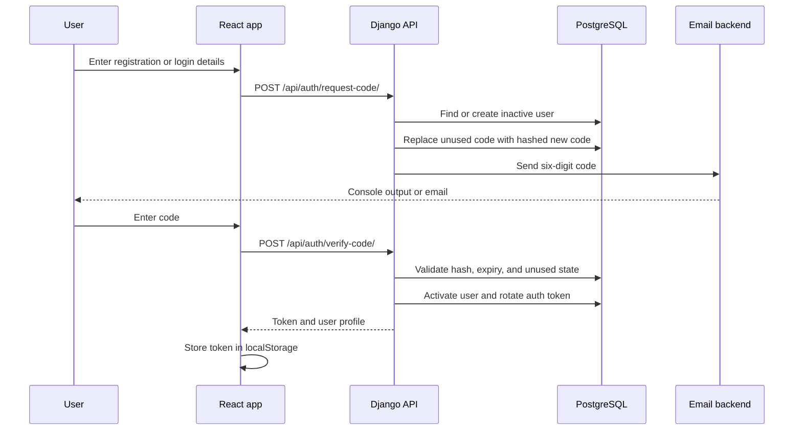
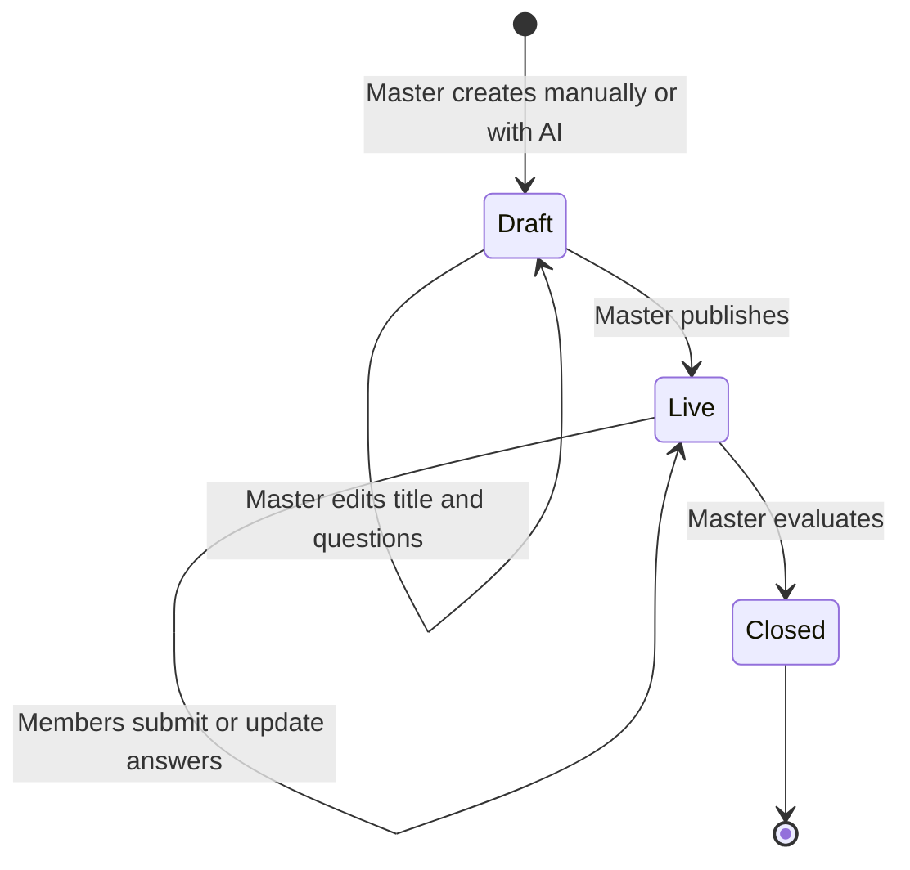

# Daily Trivia Architecture Report

## 1. Purpose and scope

Daily Trivia is a team-based web application for running recurring multiple-choice trivia. Users authenticate with email one-time codes, join teams, answer live trivia, and earn trophies. Team administrators manage membership and assign a trivia master. The master creates or generates a draft, reviews it, publishes it, and evaluates submitted answers.

This report describes the architecture that is implemented in the repository today. Product intentions and future phases are documented separately in [PLANNING.md](PLANNING.md).

## 2. System context



The system is a conventional client/server application:

- The React single-page application renders all user, team, master, and platform-administration screens.
- Django REST Framework exposes JSON endpoints under `/api/`.
- PostgreSQL is the persistent system of record.
- Django sends authentication codes through the console backend in development or SMTP in production.
- The OpenAI integration is optional. A local generator keeps development usable without an API key.

## 3. Repository layout

```text
daily-trivia/
├── backend/
│   ├── manage.py
│   ├── requirements.txt
│   ├── trivia_backend/
│   │   ├── settings.py       # Environment, database, email, CORS, DRF
│   │   └── urls.py           # /admin and /api roots
│   └── trivia_app/
│       ├── models.py         # Persistent domain model
│       ├── serializers.py    # Request validation and response shapes
│       ├── views.py          # Use cases, permissions, and transactions
│       ├── urls.py           # REST endpoint mapping
│       ├── services/
│       │   └── ai_generator.py
│       ├── migrations/       # Database schema history
│       └── tests.py          # Authentication and team/trivia workflows
├── frontend/
│   ├── src/
│   │   ├── App.jsx           # UI, client state, and interaction handlers
│   │   ├── api.js            # HTTP client and token persistence
│   │   ├── main.jsx          # React entry point and Material UI theme
│   │   └── styles.css        # Global visual system and interactions
│   └── package.json
├── .env.example              # Configuration template
├── PLANNING.md               # Product plan and implementation status
└── README.md                 # Setup and operating instructions
```

## 4. Runtime components

### 4.1 Frontend

The frontend is a React 18 application built by Vite. Material UI supplies components and theming.

`App.jsx` currently owns the application state and all major screens. Important state groups include:

- Authentication: mode, email, username, names, verification code, and authenticated user.
- Team context: available teams, selected team, invite code, members, and analytics.
- Trivia context: cycles, active session, selected answers, and leaderboard.
- Master builder: selected cycle, draft session, title, questions, choices, answer, and explanation.
- Administration: platform users, new team form, notifications, and dashboard mode.

The startup flow checks for a token in `localStorage`. If present, it calls `/auth/me/`; success restores the authenticated session and failure clears the token. Once a user is loaded, React effects fetch users, teams, cycles, and notifications. Selecting a team triggers leaderboard and, where authorized, membership and analytics requests.

`api.js` is the frontend's API boundary. It:

- Uses `VITE_API_BASE_URL`, defaulting to `http://localhost:8000/api`.
- Serializes request bodies as JSON.
- Adds `Authorization: Token <token>` when a token exists.
- Converts API error responses into JavaScript errors for display.
- Stores the token under `daily-trivia-auth-token` in browser `localStorage`.

### 4.2 Backend

The backend uses Django 5 and Django REST Framework. It is organized as a single Django application, `trivia_app`.

The views are function-based API handlers. They combine:

- Authentication and authorization checks.
- Serializer-based input validation.
- Domain workflow orchestration.
- Database queries and transactional writes.
- JSON response construction.

Serializers define public response shapes and validate question rules. In particular, trivia questions require at least two choices, and `correct_choice` must match one of those choices.

Multi-record operations such as creating/editing a trivia session and evaluating answers use `transaction.atomic()` to avoid partially applied changes.

### 4.3 Database

PostgreSQL stores users, teams, cycles, sessions, questions, answers, trophies, login codes, authentication tokens, and notifications. Django migrations under `backend/trivia_app/migrations/` define the schema history.

### 4.4 Email

Authentication codes use Django's configured email backend:

- Development: `django.core.mail.backends.console.EmailBackend` prints the message and code in the backend terminal.
- Production: SMTP settings come from `EMAIL_*` environment variables.

### 4.5 AI generation

`TriviaGenerator` has two execution paths:

1. If `OPENAI_API_KEY` exists, it calls the OpenAI Responses API using `OPENAI_MODEL`.
2. Otherwise, it generates deterministic placeholder questions locally.

The OpenAI prompt requests a JSON object containing a fixed number of questions. The service validates that every generated question has exactly four choices, that its correct answer occurs in those choices, and that the response contains the requested number of questions. Invalid AI output raises an error and becomes a `502` API response.

## 5. Data model



### Core entities

| Entity | Responsibility | Important rules |
| --- | --- | --- |
| Django `User` | Identity and platform-admin state | Username is unique; email uniqueness is enforced by registration logic; names use built-in fields |
| `EmailLoginCode` | Hashed, expiring one-time authentication code | Only unused, unexpired codes can authenticate |
| `Team` | Persistent collaboration boundary | Unique slug and invite code; created by a user |
| `TeamMembership` | User's role and admission state in a team | Unique per user/team; role is member or team admin; status is pending, approved, or rejected |
| `MasterCycle` | Topic, date window, and assigned master | Belongs to a team in normal operation; status is draft, active, or closed |
| `TriviaSession` | Publishable quiz within a cycle | Status moves from draft to live to closed |
| `TriviaQuestion` | Multiple-choice question | Choices are JSON; correct answer and explanation are hidden from normal participants |
| `UserAnswer` | One user's selection for one question | Unique per session/question/user; submissions update the existing answer |
| `TrophyAward` | Immutable-style achievement record | At most one trophy per user per trivia session |
| `Notification` | In-app publication message | Scoped to a user and team; `read_at` tracks acknowledgement |

Deletion behavior preserves important history. Masters, team creators, and trophy recipients use protected relationships in key places, while dependent session content and memberships generally cascade.

## 6. Authentication flow



Registration includes first name, last name, username, and email. Login only requires an existing email. Codes are six digits, stored as password hashes rather than plaintext, and expire after `LOGIN_CODE_EXPIRY_MINUTES`.

On successful verification:

- The code is marked as used.
- An inactive registration becomes active.
- An email listed in `PLATFORM_ADMIN_EMAILS` becomes staff and superuser.
- Existing API tokens for the user are deleted.
- A new token is returned to the frontend.

Logout deletes the user's token, making subsequent authenticated requests fail.

## 7. Authorization model

The backend is authoritative. IDs, usernames, and roles supplied by the browser are never sufficient by themselves.

| Capability | Member | Assigned master | Team admin | Platform admin |
| --- | :---: | :---: | :---: | :---: |
| View approved team's trivia | Yes | Yes | Yes | Yes |
| Submit live answers | Yes | Yes | Yes | Yes |
| View team leaderboard | Yes | Yes | Yes | Yes |
| Create/edit/publish/evaluate assigned cycle trivia | No | Yes | No, unless also master | Yes |
| View/manage team membership | No | No | Yes | Yes |
| Assign a team cycle master | No | No | Yes | Yes |
| Create teams | No | No | No | Yes |
| Promote platform administrators | No | No | No | Superuser only |
| Delete eligible users | No | No | No | Yes |

Reusable backend checks implement this model:

- `is_approved_member(user, team)`
- `is_team_admin(user, team)`
- `can_manage_cycle(user, cycle)`

Platform administrators bypass team membership checks. Invite codes are removed from serialized team responses unless the requester can manage that team.

## 8. Team and membership flow

1. A platform administrator creates a team.
2. The creator automatically receives an approved team-admin membership.
3. Another authenticated user submits the team's invite code.
4. The membership becomes approved immediately or pending, depending on `approval_required`.
5. A team administrator can approve, reject, promote, demote, or remove members.
6. Only approved members can view or answer the team's trivia.

A rejected user may use the invite code again. The membership returns to pending or approved according to the team's current admission policy.

## 9. Trivia lifecycle



### Creation

A team administrator creates a `MasterCycle` and assigns an approved team member as master. The master can then:

- Create a manual session with validated questions.
- Ask the AI service to create a five-question draft.
- Reload and replace the questions of an existing draft.

### Publication

Publishing changes the session to `live` and records `publish_at`. The API creates an in-app notification for every approved team member except the publisher.

Normal participants receive a public question representation containing only the prompt, choices, and order. The correct answer and explanation are included only for the assigned master or a platform administrator.

### Answer submission

The API accepts answers only while the session is live and only from approved team members. It ignores any client-supplied user identity and always associates the answer with `request.user`. It also verifies that:

- The question belongs to the requested session.
- The selected answer is one of the question's available choices.

Submitting again updates the user's existing selection for that question.

### Evaluation and trophies

The assigned master or a platform administrator evaluates the session. Within one transaction, the API:

1. Compares every selected choice with the stored correct choice.
2. Marks each answer and records `evaluated_at`.
3. Creates a trophy for each user who has at least one correct answer.
4. Closes the session and records `close_at`.

The unique trophy constraint makes repeated evaluation idempotent for awards: a user cannot receive a duplicate trophy for the same session.

The leaderboard counts trophy records, optionally filtered by team, and sorts by trophy count descending and username ascending.

## 10. API surface

All routes are prefixed with `/api/`. Except for requesting and verifying an email code, endpoints require token authentication.

### Authentication and users

| Method | Route | Purpose |
| --- | --- | --- |
| `POST` | `/auth/request-code/` | Register or request a login code |
| `POST` | `/auth/verify-code/` | Verify code and issue token |
| `GET` | `/auth/me/` | Restore authenticated user |
| `POST` | `/auth/logout/` | Delete current token |
| `GET` | `/users/` | List active users |
| `DELETE` | `/users/{id}/` | Platform-admin user removal |
| `PATCH` | `/admin/users/{id}/` | Add or remove platform-admin access |

### Teams

| Method | Route | Purpose |
| --- | --- | --- |
| `GET`, `POST` | `/teams/` | List accessible teams or create a team |
| `POST` | `/teams/join/` | Join using an invite code |
| `GET` | `/teams/{id}/members/` | List team memberships |
| `PATCH`, `DELETE` | `/teams/{teamId}/members/{membershipId}/` | Manage one membership |
| `GET` | `/teams/{id}/analytics/` | Return summary counts |
| `GET` | `/leaderboard/?team={id}` | Return team trophy ranking |
| `GET`, `POST` | `/notifications/` | List or mark notifications read |

### Trivia

| Method | Route | Purpose |
| --- | --- | --- |
| `GET`, `POST` | `/master-cycles/` | List accessible cycles or assign a master |
| `POST` | `/master-cycles/{id}/generate-trivia/` | Generate an AI/local draft |
| `POST` | `/master-cycles/{id}/trivia-sessions/` | Create a manual draft |
| `GET` | `/trivia-sessions/{id}/` | Retrieve role-appropriate session data |
| `PUT` | `/trivia-sessions/{id}/edit/` | Replace a draft's title/questions |
| `POST` | `/trivia-sessions/{id}/publish/` | Publish a draft |
| `POST` | `/trivia-sessions/{id}/answers/` | Submit or update one answer |
| `POST` | `/trivia-sessions/{id}/evaluate/` | Score answers, award trophies, and close |

## 11. Configuration and environments

Django loads the root `.env` file. The main configuration groups are:

- `DJANGO_*`: secret key, debug state, allowed hosts, and CORS origins.
- `POSTGRES_*`: database name, user, password, host, and port.
- `EMAIL_*`: email backend and SMTP delivery.
- `PLATFORM_ADMIN_EMAILS`: comma-separated initial administrator allowlist.
- `LOGIN_CODE_EXPIRY_MINUTES`: one-time-code lifetime.
- `OPENAI_API_KEY` and `OPENAI_MODEL`: optional generation service.
- `VITE_API_BASE_URL`: frontend API base URL read by Vite at build/development-server startup.

Development normally runs as two processes:

```text
React/Vite  http://localhost:5173
Django      http://localhost:8000
PostgreSQL  127.0.0.1:5432
```

CORS permits the configured frontend origin to call Django. Production must use a non-default Django secret, disable debug mode, configure exact allowed hosts/origins, use production SMTP, and protect all secrets outside source control.

## 12. Testing strategy

`backend/trivia_app/tests.py` currently provides two end-to-end API workflow tests:

- Registration, email-code verification, platform-admin bootstrap, authenticated identity, and logout.
- Team creation/admission, master assignment, manual trivia, answer submission, evaluation, notification behavior, answer secrecy, and leaderboard results.

The frontend currently uses the Vite production build as its automated validation. There are no component or browser end-to-end tests yet.

## 13. Current architectural characteristics and improvement areas

The current structure is appropriate for an MVP: it is small, direct, and keeps business behavior easy to trace. As the product grows, the following areas are likely refactoring boundaries:

1. **Frontend decomposition:** `App.jsx` owns most state and rendering. Split authentication, team administration, trivia play, builder, and platform administration into components and feature hooks.
2. **Backend service layer:** workflow logic currently lives in views. Extract membership, publication, evaluation, and notification services when those workflows gain more rules.
3. **API schema:** add OpenAPI generation and explicit request serializers for authentication and workflow commands.
4. **Database invariants:** email uniqueness is checked in application code rather than enforced by a case-insensitive database constraint.
5. **Token storage:** browser `localStorage` is simple but exposed to injected JavaScript. A hardened production design could use secure, HTTP-only cookies with CSRF protection.
6. **Lifecycle guards:** publishing and evaluation endpoints can be made stricter about permitted source states and cycle date windows.
7. **Background work:** AI generation and production email are synchronous. A task queue would prevent slow external calls from holding API requests.
8. **Observability:** structured logs, error reporting, metrics, and audit events are not yet present.
9. **Frontend testing:** add component tests and browser tests for role-dependent screens and the complete trivia journey.
10. **Deployment definition:** the repository does not yet contain container, infrastructure, or CI/CD definitions.

## 14. Suggested reading order for new contributors

1. [PLANNING.md](PLANNING.md) for the product and roles.
2. [backend/trivia_app/models.py](backend/trivia_app/models.py) for the domain vocabulary.
3. [backend/trivia_app/urls.py](backend/trivia_app/urls.py) for available operations.
4. [backend/trivia_app/views.py](backend/trivia_app/views.py) for permissions and workflows.
5. [backend/trivia_app/serializers.py](backend/trivia_app/serializers.py) for API data shapes.
6. [frontend/src/api.js](frontend/src/api.js) for frontend/backend integration.
7. [frontend/src/App.jsx](frontend/src/App.jsx) for the current user experience.
8. [backend/trivia_app/tests.py](backend/trivia_app/tests.py) for executable examples of the main flows.
